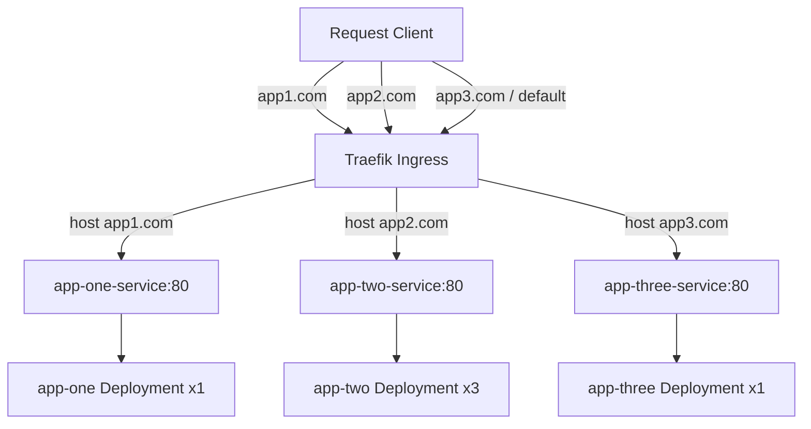
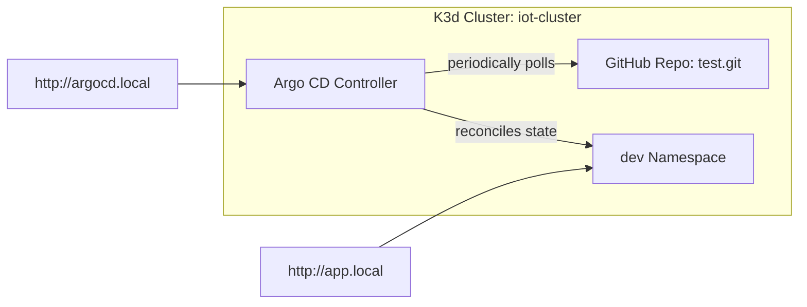
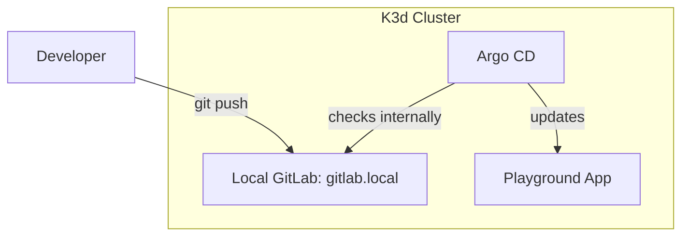

# Inception of Things (IoT)

A comprehensive DevOps project focused on setting up local Kubernetes infrastructure using K3s, K3d, Vagrant, and VirtualBox, combined with GitOps continuous deployment using Argo CD and self-hosted GitLab.

---

## 🏗️ Repository Architecture

This repository is organized into distinct phases of complexity, building from virtualized infrastructure to advanced in-cluster GitOps workflows:

```
Inception-of-things/
├── p1/                         # Part 1: K3s Multi-Node Cluster
│   ├── Vagrantfile             # VM definition for Server and Agent
│   └── scripts/
│       ├── server_setup.sh     # Controller Node bootstrap script
│       └── worker_setup.sh     # Worker Node bootstrap script
│
├── p2/                         # Part 2: K3s Ingress and Services
│   ├── Vagrantfile             # Single Controller VM configuration
│   ├── confs/
│   │   ├── apps.yaml           # Deployment + Service manifests for App 1, 2, 3
│   │   └── ingress.yaml        # Traefik Ingress routing configuration
│   └── scripts/
│       └── setup.sh            # Controller VM bootstrap + app deployment script
│
├── p3/                         # Part 3: K3d Cluster with Argo CD
│   ├── confs/
│   │   └── argocd/
│   │       ├── Ingress.yaml    # Argo CD Ingress configuration
│   │       └── application.yaml# Argo CD Application configuration (GitOps)
│   └── scripts/
│       ├── deps.sh             # Dependency installer (Docker, K3d, kubectl)
│       ├── argocd.sh           # Argo CD namespace setup + deployment + commands
│       └── setup.sh            # Orchestrator script for Part 3
│
└── bonus/                      # Bonus: Self-hosted GitOps Pipeline
    ├── confs/
    │   ├── app/                # Target application manifests (v1)
    │   │   ├── deployment.yaml
    │   │   ├── service.yaml
    │   │   └── ingress.yaml
    │   ├── argocd/
    │   │   ├── Ingress.yaml
    │   │   └── application.yaml# Argo CD mapping to GitLab in-cluster repository
    │   └── gitlab/
    │       ├── 01-volumes.yaml  # GitLab PV & PVC storage manifests
    │       ├── 02-Service.yaml  # GitLab ClusterIP service
    │       ├── 03-Deployment.yaml# GitLab CE Deployment & environment setup
    │       └── 04-ingress.yaml  # Ingress routing for gitlab.local
    └── scripts/
        ├── deps.sh             # Cluster setup scripts
        ├── argocd.sh           # Argo CD deployment script
        ├── gitlab.sh           # GitLab deployment + waiting loop
        └── setup.sh            # Complete orchestrator script
```

---

## 🛠️ Technology Stack & Core Concepts

* **[K3s](https://k3s.io/):** Lightweight Kubernetes distribution designed for resource-constrained environments (ideal for local virtual machines).
* **[K3d](https://k3d.io/):** A helper utility to run K3s inside Docker containers, facilitating fast local cluster testing.
* **[Vagrant](https://www.vagrantup.com/) & [VirtualBox](https://www.virtualbox.org/):** Infrastructure-as-code to spin up, configure, and isolate guest operating systems (Debian Bookworm) automatically.
* **[Argo CD](https://argoproj.github.io/cd/):** Declarative, GitOps continuous delivery tool for Kubernetes that automates deployment of tracked resources.
* **[GitLab CE](https://about.gitlab.com/):** Host-your-own VCS repository server deployed directly inside Kubernetes to implement secure, local source-of-truth syncing.

---

## 🚀 Detailed Phase Walkthrough

### 📦 Part 1: K3s Multi-Node Vagrant Cluster
Deploys a multi-node Kubernetes cluster across two virtual machines running Debian Bookworm.

```mermaid
graph LR
    subgraph Host OS
      Vagrantfile[Vagrant Environment]
    end
    subgraph VM 1: testS (Controller)
      direction TB
      K3sS[K3s Server] -- generates --> Token[node-token]
    end
    subgraph VM 2: testSW (Agent)
      direction TB
      K3sA[K3s Agent] -- joins via token --> K3sS
    end
    Vagrantfile --> testS
    Vagrantfile --> testSW
```

* **Environment definition:** Configured in [p1/Vagrantfile](file:///Users/rh/Desktop/Inception-of-things/p1/Vagrantfile).
* **Server Node (`testS`):** Controller Node running on `192.168.56.110`. Configured via [server_setup.sh](file:///Users/rh/Desktop/Inception-of-things/p1/scripts/server_setup.sh). Swapon configuration is managed, swap failsafe is bypassed, and Traefik, ServiceLB, and metrics servers are disabled to conserve resources. Writes cluster `node-token` to `/vagrant/node-token` (shared folder).
* **Worker Node (`testSW`):** Agent Node running on `192.168.56.111`. Configured via [worker_setup.sh](file:///Users/rh/Desktop/Inception-of-things/p1/scripts/worker_setup.sh). Boots up, blocks until the node token is shared by the controller, and registers itself as a worker node joining `https://192.168.56.110:6443`.

#### Installation:
```bash
cd p1
vagrant up
```
#### Verification:
SSH into the controller and run:
```bash
vagrant ssh testS
kubectl get nodes -o wide
```

---

### 🌐 Part 2: K3s Ingress & Multi-App Routing
Sets up a single controller VM (`testS`, IP `192.168.56.110`) using default Traefik routing to serve three distinct Nginx applications behind an Ingress resource.



* **Environment configuration:** Set up in [p2/Vagrantfile](file:///Users/rh/Desktop/Inception-of-things/p2/Vagrantfile) and provisioned by [setup.sh](file:///Users/rh/Desktop/Inception-of-things/p2/scripts/setup.sh).
* **Deployments & Services:** Defined in [apps.yaml](file:///Users/rh/Desktop/Inception-of-things/p2/confs/apps.yaml):
  * `app-one` (1 replica): Nginx serving `"Hello from app1."`
  * `app-two` (3 replicas): Nginx serving `"Hello from app2."`
  * `app-three` (1 replica): Nginx serving `"Hello from app3."`
* **Ingress Mapping:** Configured in [ingress.yaml](file:///Users/rh/Desktop/Inception-of-things/p2/confs/ingress.yaml):
  * Request host `app1.com` paths to `app-one`
  * Request host `app2.com` paths to `app-two`
  * Request host `app3.com` paths to `app-three`
  * Fallback (no match or wildcard) paths to `app-three`

#### Installation:
```bash
cd p2
vagrant up
```
#### Verification:
Add routing maps to your host `/etc/hosts` file or run `curl` inside the Vagrant VM:
```bash
vagrant ssh testS
curl -H "Host: app1.com" http://192.168.56.110
curl -H "Host: app2.com" http://192.168.56.110
curl -H "Host: app3.com" http://192.168.56.110
curl http://192.168.56.110   # Fallback (app-three)
```

---

### 🔄 Part 3: K3d Cluster & GitOps with Argo CD
Spins up a lightweight containerized cluster (`iot-cluster`) using `K3d` and configures `Argo CD` to automatically synchronize changes from a public repository.



* **Setup Orchestration:** Managed by [setup.sh](file:///Users/rh/Desktop/Inception-of-things/p3/scripts/setup.sh).
* **Dependencies:** Managed in [deps.sh](file:///Users/rh/Desktop/Inception-of-things/p3/scripts/deps.sh) which installs Docker, K3d, and kubectl, and configures the kubeconfig profile on the host.
* **Argo CD deployment:** Configured via [argocd.sh](file:///Users/rh/Desktop/Inception-of-things/p3/scripts/argocd.sh). It deploys Argo CD in namespace `argocd`, disables SSL/TLS for simplified local interaction, patches credentials to default `admin`/`admin` (via a customized bcrypt secret key), maps `/etc/hosts` configuration for routing endpoints, and triggers the synchronization.
* **Argo CD Custom Ingress:** [Ingress.yaml](file:///Users/rh/Desktop/Inception-of-things/p3/confs/argocd/Ingress.yaml) defines access at `http://argocd.local`.
* **Git Repository Tracked:** Configured in [application.yaml](file:///Users/rh/Desktop/Inception-of-things/p3/confs/argocd/application.yaml) pointing to `https://github.com/rh-oussama/test.git` (manifests directory), deployed directly to the `dev` namespace.

#### Installation:
```bash
cd p3/scripts
sudo ./setup.sh install
```
#### Verification:
Access Argo CD dashboard via your browser: `http://argocd.local` (Username: `admin`, Password: `admin`).
Test the application: `curl http://app.local`

---

### 🎁 Bonus: The Self-Hosted GitOps Loop
Elevates Part 3 by replacing the external Git repository with a self-hosted **GitLab** service running inside the same K3d cluster.



* **Setup Orchestration:** Orchestrated via [setup.sh](file:///Users/rh/Desktop/Inception-of-things/bonus/scripts/setup.sh).
* **GitLab Deployment:** Managed by [gitlab.sh](file:///Users/rh/Desktop/Inception-of-things/bonus/scripts/gitlab.sh) and configures GitLab using the manifests inside [bonus/confs/gitlab](file:///Users/rh/Desktop/Inception-of-things/bonus/confs/gitlab):
  * [01-volumes.yaml](file:///Users/rh/Desktop/Inception-of-things/bonus/confs/gitlab/01-volumes.yaml): Storage setup for GitLab.
  * [02-Service.yaml](file:///Users/rh/Desktop/Inception-of-things/bonus/confs/gitlab/02-Service.yaml): Internal communication mapping.
  * [03-Deployment.yaml](file:///Users/rh/Desktop/Inception-of-things/bonus/confs/gitlab/03-Deployment.yaml): Container specs and configurations.
  * [04-ingress.yaml](file:///Users/rh/Desktop/Inception-of-things/bonus/confs/gitlab/04-ingress.yaml): Domain access for `http://gitlab.local`.
* **Argo CD Setup:** [argocd.sh](file:///Users/rh/Desktop/Inception-of-things/bonus/scripts/argocd.sh) deploys Argo CD and configures [application.yaml](file:///Users/rh/Desktop/Inception-of-things/bonus/confs/argocd/application.yaml) pointing to the internal GitLab endpoint `http://gitlab-web.gitlab.svc.cluster.local/root/test.git` to deploy the app components from [bonus/confs/app](file:///Users/rh/Desktop/Inception-of-things/bonus/confs/app):
  * [deployment.yaml](file:///Users/rh/Desktop/Inception-of-things/bonus/confs/app/deployment.yaml)
  * [service.yaml](file:///Users/rh/Desktop/Inception-of-things/bonus/confs/app/service.yaml)
  * [ingress.yaml](file:///Users/rh/Desktop/Inception-of-things/bonus/confs/app/ingress.yaml)

#### Installation:
```bash
cd bonus/scripts
sudo ./setup.sh install
```
#### Verification:
* GitLab URL: `http://gitlab.local` (Username: `root`, Password: `0x%Qx[$71wb_`)
* Argo CD URL: `http://argocd.local` (Username: `admin`, Password: `admin`)
* Playground App: `curl http://app.local`

---

## 🔑 Infrastructure Access & Credentials

| Phase | Service / Resource | Endpoint | Username | Password / Token |
| :--- | :--- | :--- | :--- | :--- |
| **p1** | Controller Node | `192.168.56.110:6443` | `vagrant` | Vagrant SSH Key |
| **p1** | Worker Node | `192.168.56.111` | `vagrant` | Vagrant SSH Key |
| **p2** | App 1 | `http://192.168.56.110` (Host: `app1.com`) | *N/A* | *Public* |
| **p2** | App 2 | `http://192.168.56.110` (Host: `app2.com`) | *N/A* | *Public* |
| **p2** | App 3 / Default | `http://192.168.56.110` (Host: `app3.com`) | *N/A* | *Public* |
| **p3** | Argo CD Dashboard | `http://argocd.local` | `admin` | `admin` |
| **p3** | Sync App | `http://app.local` | *N/A* | *Public* |
| **Bonus**| Argo CD Dashboard | `http://argocd.local` | `admin` | `admin` |
| **Bonus**| Local GitLab Instance| `http://gitlab.local` | `root` | `0x%Qx[$71wb_` |
| **Bonus**| Playground App | `http://app.local` | *N/A* | *Public* |

---

## 🛠️ Commands Cheatsheet

### Vagrant (p1 & p2)
```bash
# Start the virtual machines defined in the Vagrantfile
vagrant up

# Check status of running machines
vagrant status

# SSH into the server node
vagrant ssh testS

# Clean up / destroy virtual environments
vagrant destroy -f
```

### K3d & Kubernetes (p3 & bonus)
```bash
# Check running k3d clusters
k3d cluster list

# Delete the cluster
k3d cluster delete iot-cluster

# Check all deployed pods across all namespaces
kubectl get pods -A

# Check services in the dev namespace
kubectl get svc -n dev

# Fetch Ingress configuration status
kubectl get ingress -A
```

---

## ⚠️ Important Configuration Notes
* **Hosts Resolution:** To resolve custom domain names (`argocd.local`, `app.local`, `gitlab.local`) outside curl, make sure they are appended to your local machine's `/etc/hosts` file (or host machine resolver map).
* **GitLab Initial Provisioning:** GitLab container startup might take several minutes to run migrations and initialize its internal server components. Use `kubectl get pods -n gitlab -w` to monitor its status before logging in.
