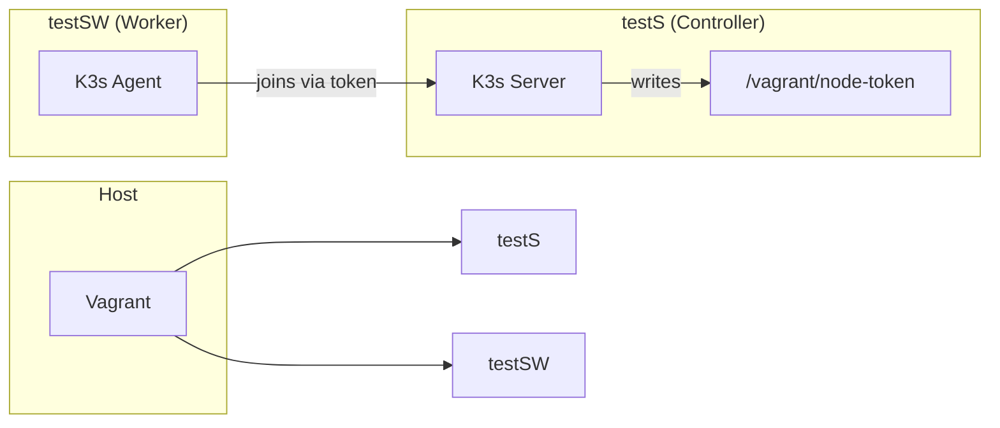
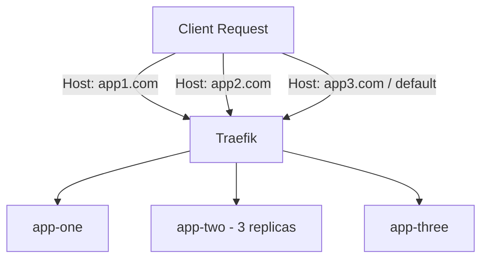
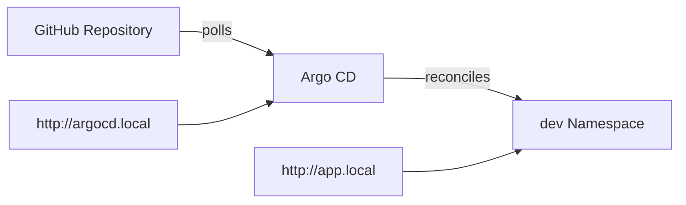
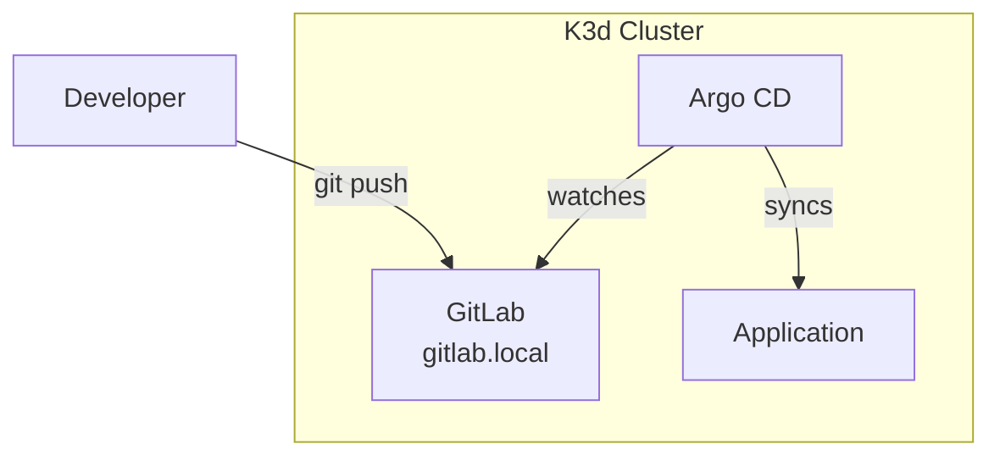

# Inception of Things (IoT)

A DevOps project that builds Kubernetes infrastructure from the ground up using K3s, K3d, Vagrant, and implements GitOps workflows with Argo CD and self-hosted GitLab.

The project is divided into four progressive parts, starting with virtual machine provisioning and ending with a fully local GitOps pipeline.

## Repository Structure

```
Inception-of-things/
├── p1/                         # K3s multi-node cluster with Vagrant
│   ├── Vagrantfile
│   └── scripts/
│       ├── server_setup.sh
│       └── worker_setup.sh
│
├── p2/                         # K3s + Ingress + three applications
│   ├── Vagrantfile
│   ├── confs/
│   │   ├── apps.yaml
│   │   └── ingress.yaml
│   └── scripts/
│       └── setup.sh
│
├── p3/                         # K3d + Argo CD (GitOps from GitHub)
│   ├── confs/
│   │   └── argocd/
│   │       ├── Ingress.yaml
│   │       └── application.yaml
│   └── scripts/
│       ├── deps.sh
│       ├── argocd.sh
│       └── setup.sh
│
└── bonus/                      # Self-hosted GitOps with GitLab
    ├── confs/
    │   ├── app/
    │   │   ├── deployment.yaml
    │   │   ├── service.yaml
    │   │   └── ingress.yaml
    │   ├── argocd/
    │   │   ├── Ingress.yaml
    │   │   └── application.yaml
    │   └── gitlab/
    │       ├── 01-volumes.yaml
    │       ├── 02-Service.yaml
    │       ├── 03-Deployment.yaml
    │       └── 04-ingress.yaml
    └── scripts/
        ├── deps.sh
        ├── argocd.sh
        ├── gitlab.sh
        └── setup.sh
```

## Technology Stack

- **K3s** — Lightweight Kubernetes distribution
- **K3d** — K3s in Docker containers for fast local clusters
- **Vagrant + VirtualBox** — Infrastructure as code for virtual machines
- **Argo CD** — Declarative GitOps continuous delivery
- **GitLab CE** — Self-hosted Git repository and CI/CD platform

## Part 1: K3s Multi-Node Cluster

Deploys a two-node K3s cluster using Vagrant on Debian Bookworm.

- Controller node (`testS`): `192.168.56.110`
- Worker node (`testSW`): `192.168.56.111`



**Run:**
```bash
cd p1
vagrant up
```

**Verify:**
```bash
vagrant ssh testS
kubectl get nodes -o wide
```

## Part 2: K3s Ingress and Applications

Deploys three Nginx applications behind a Traefik Ingress on a single K3s node. Routing is based on the `Host` header.

- `app1.com` → app-one (1 replica)
- `app2.com` → app-two (3 replicas)
- `app3.com` / default → app-three (1 replica)



**Run:**
```bash
cd p2
vagrant up
```

**Verify** (add entries to `/etc/hosts` or run inside the VM):
```bash
vagrant ssh testS

curl -H "Host: app1.com" http://192.168.56.110
curl -H "Host: app2.com" http://192.168.56.110
curl -H "Host: app3.com" http://192.168.56.110
curl http://192.168.56.110
```

## Part 3: K3d + Argo CD (GitOps)

Creates a local K3d cluster and configures Argo CD to continuously sync manifests from a public GitHub repository.



**Run:**
```bash
cd p3/scripts
sudo ./setup.sh install
```

**Verify:**
- Argo CD: http://argocd.local (admin / admin)
- Application: `curl http://app.local`

## Bonus: Self-Hosted GitOps with GitLab

Replaces the external GitHub repository with a self-hosted GitLab instance running inside the same K3d cluster. Argo CD now watches the internal GitLab repository.



**Run:**
```bash
cd bonus/scripts
sudo ./setup.sh install
```

**Verify:**
- GitLab: http://gitlab.local (root / `0x%Qx[$71wb_`)
- Argo CD: http://argocd.local (admin / admin)
- Application: `curl http://app.local`

## Access Credentials

| Part     | Service              | URL / IP                        | Username | Password          |
|----------|----------------------|----------------------------------|----------|-------------------|
| p1       | Controller (SSH)     | 192.168.56.110                   | vagrant  | Vagrant key       |
| p1       | Worker (SSH)         | 192.168.56.111                   | vagrant  | Vagrant key       |
| p2       | Applications         | http://192.168.56.110            | -        | Public            |
| p3       | Argo CD              | http://argocd.local              | admin    | admin             |
| p3       | Application          | http://app.local                 | -        | Public            |
| Bonus    | GitLab               | http://gitlab.local              | root     | `0x%Qx[$71wb_`    |
| Bonus    | Argo CD              | http://argocd.local              | admin    | admin             |
| Bonus    | Application          | http://app.local                 | -        | Public            |

## Useful Commands

### Vagrant (p1 & p2)
```bash
vagrant up                  # Start VMs
vagrant status
vagrant ssh testS
vagrant destroy -f
```

### Kubernetes & K3d (p3 & Bonus)
```bash
k3d cluster list
k3d cluster delete iot-cluster
kubectl get pods -A
kubectl get svc -n dev
kubectl get ingress -A
```

## Important Notes

- Add the following domains to your `/etc/hosts` file for local resolution:
  ```
  127.0.0.1 argocd.local app.local gitlab.local
  ```
- GitLab may take several minutes to become ready after deployment. Monitor with:
  ```bash
  kubectl get pods -n gitlab -w
  ```
- All scripts in `scripts/` folders are designed to be idempotent where possible.

---

This project was completed as part of a System Administration curriculum focused on Kubernetes and GitOps practices.